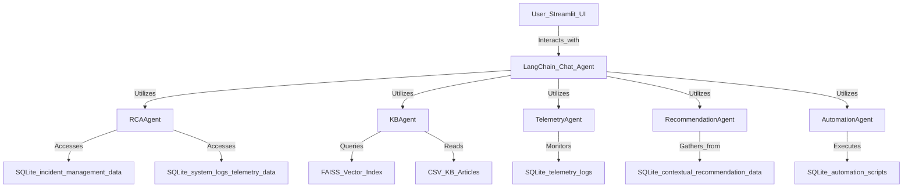

# 🤖 GenAI MCP Chatbot – Platform Support Assistant(SmartOps)

This project is a full-stack GenAI-powered chatbot for platform support teams. It integrates telemetry, incident logs, KB articles, and automation scripts to provide real-time, context-aware incident resolution using LangChain agents and OpenAI GPT.

# MCP Chatbot Architecture

This diagram illustrates the complete architecture and workflow of the GenAI-powered MCP Chatbot.

## Architecture Diagram



---

## Data Sources

- `incident_analysis_data.db` (SQLite)
- `kb_faiss_index/` (FAISS index folder)
- `knowledge_base_articles_extended.csv`
- `contextual_recommendation_data` (embedded or separate CSV)

## Agent Tools

- **RCAAgent** – Summarizes incident root cause with logs
- **KBAgent** – Retrieves relevant KB articles
- **TelemetryAgent** – Detects anomalies in telemetry
- **RecommendationAgent** – Suggests next steps
- **AutomationAgent** – Suggests scripts to fix issues

---

## 🚀 Features

- 🧠 **Multi-Agent MCP Chatbot** powered by LangChain + OpenAI
- 🗃️ Integrated with SQLite for telemetry, incidents, KB, and automation data
- 🔍 Vector-based semantic search of KB articles using FAISS
- 🔧 RCA, telemetry anomaly detection, recommendations, and simulated remediation
- 💬 Streamlit UI with multi-turn conversational memory
- 📦 Modular architecture with agents, core, and UI layers

---

## 📁 Project Structure i.e. under code/src

```
SmartOps/
├── agents/                      ← All agent tools (RCA, KB, telemetry, etc.)
├── /kb_*                        ← FAISS index & builder for KB articles
├── data/                        ← SQLite database (MCP context store
├── /incident_resolver.py        ← Incident RCA and quick resolve issue
├── /mcp_chatbot_ui.py           ← Streamlit UI entry point
├── /mcp_chatbot_agent.py        ← LangChain unified agent setup
├── /ui.py                       ← main file to run the app
├── requirements.txt             ← App dependencies
├── README.md
```

---

## 🛠️ Setup Instructions

### 1. Install Dependencies

```bash
pip install -r requirements.txt
```

```
Edit `.env` and add your OpenAI API key:
```
OPENAI_API_KEY=sk-... (Edit with your OpenAI API key)
```

### 3. Run the Chatbot UI

```bash
/code/src -> streamlit run ui.py
```

---

## 💡 Example Queries

- “What caused incident inc045?”
- “Are there any active CPU anomalies?”
- “Search KB for memory leaks.”
- “Is there a recommended script for high CPU?”

---

## 🧪 Powered By

- [LangChain](https://www.langchain.com/)
- [OpenAI GPT](https://platform.openai.com/)
- [FAISS](https://github.com/facebookresearch/faiss)
- [Streamlit](https://streamlit.io/)
- SQLite, Pandas

---

## 📄 License

MIT License – feel free to build on top of this!
