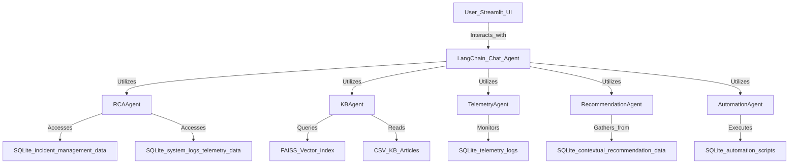

# MCP Chatbot Architecture

This diagram illustrates the complete architecture and workflow of the GenAI-powered MCP Chatbot.

## Architecture Diagram

---

## Data Sources

- `incident_analysis_data.db` (SQLite)
- `kb_faiss_index/` (FAISS index folder)
- `knowledge_base_articles_extended.csv`
- `contextual_recommendation_data` (embedded or separate CSV)

## Agent Tools

- **RCAAgent** – Summarizes incident root cause with logs
- **KBAgent** – Retrieves relevant KB articles
- **TelemetryAgent** – Detects anomalies in telemetry
- **RecommendationAgent** – Suggests next steps
- **AutomationAgent** – Suggests scripts to fix issues
